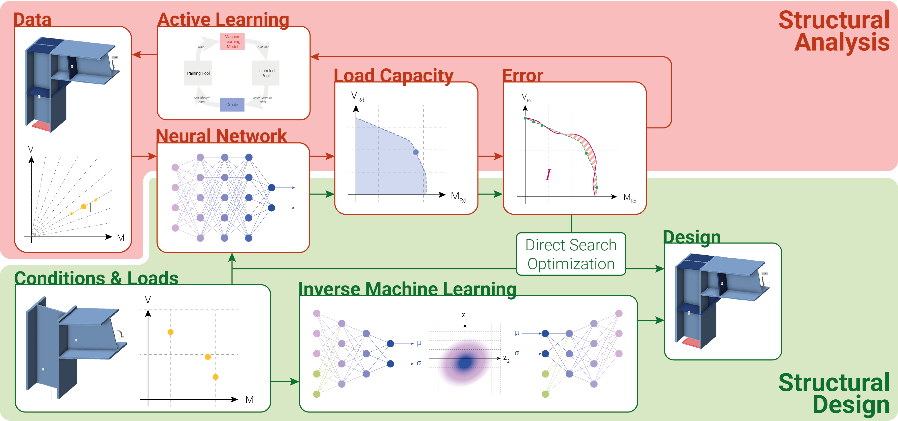

# Use of Machine Learning in in the design of steel connections

**Author**: Benjamin Urben 
**Email**: burben@student.ethz.ch / benjamin.urben@hotmail.ch 
**Context**: Master Thesis on "Use of Machine Learning in the Design and Analysis of Steel Connections" 
**Period**: 2025 March - June 
**Institution**: ETH Zürich, Institute of Structural Engineering (IBK)

This respository complements the conceptually introduced Methodology and Results in the Master Thesis.

> [!IMPORTANT]
> The database and the Application Programming Interface (API) used for this Master Thesis are not public, hence not listed on this repository. For interest in the database reach out to ...

## Environment

The necessary modules can be obtained through the conda environment file `MA.yaml` or the `requirements.txt`.

## Table of Contents
- Structural Analysis
  - Deep Neural Network
    - `DNN.py`
    - `DNN_FullModel.ipynb`
    - `DNN_MV_Interaction_Analysis.ipynb`
  - Active Learning
    - `AL_API/Local_AL.ipynb`
    - `AL_API/GLobal_AL.ipynb`
    - `AL_API/LocalObjectives.ipynb`
- Structural Design
  - Inverse Machine Learning
    - `CVAE.py`
    - `CVAE_FullModel.ipynb`
    - `CVAE_LossBalancing.ipynb`
    - `CVAE_Interpretability_Analysis.ipynb`
  - Forward Optimization
    - `Design_Optimization_Workflow.ipynb`
    - `Design_Optimization_Interactive.ipynb`
- Interpretability
  - `MC_Dropout_Quantification.ipynb`
  - `Feasibly_Hypercubemap_Generation.ipynb`
- Utils
  - `Datareader.py`
  - `Settings.py`

