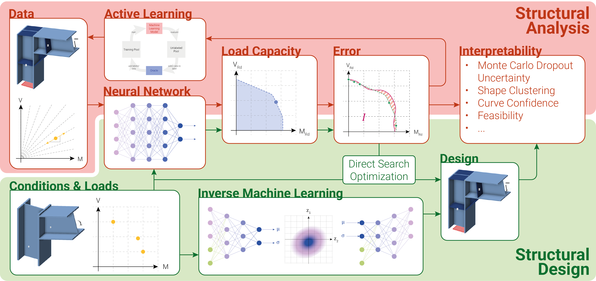

# Use of Machine Learning in in the Design and Analysis of Steel Connections

**Author**: Benjamin Urben 
**Email**: burben@student.ethz.ch / benjamin.urben@hotmail.ch 
**Context**: Master Thesis on "Use of Machine Learning in the Design and Analysis of Steel Connections" 
**Period**: 2025 March - June 
**Institution**: ETH Zürich, Institute of Structural Engineering (IBK)

## Overview

This respository complements the conceptually introduced Methodology and Results in the Master Thesis.

## Abstract

This thesis examines the integration of machine learning into structural engineering, with a 
speci c focus on the design and analysis of steel connections. Leveraging a large, 
parametrized dataset of steel frame corner connections – each evaluated via Finite Element 
Method (FEM) using IDEA StatiCa – we develop a series of data-driven models to predict and 
optimize structural performance. Given the nonlinear and interdependent nature of structural 
behavior, classical statistical approaches failed to capture meaningful correlations between 
input parameters and load capacities. This motivated the use of deep neural networks (DNNs), 
which demonstrate high accuracy in predicting moment and shear resistance, enabling the 
generation of full interaction curves with minimal computational cost. 

The research is structured around two domains: structural analysis, where we train DNNs as 
surrogates for FEM simulations, and structural design, where we embed these models within 
optimization work ows to suggest feasible connection designs under given loading 
conditions. To improve interpretability and reliability, we apply unsupervised clustering and 
uncertainty quanti cation techniques, which enhance the model’s transparency and guide 
targeted model improvements. Additionally, we introduced active learning frameworks to 
strategically expand the dataset in both known weak spots and previously unexplored regions 
of the design space. We achieve this through our model-driven data acquisition strategies, 
which we support by uncertainty-aware sampling and automated FEM integration. We took 
a further step toward generative design by implementing a Conditional Variational 
Autoencoder (CVAE), allowing us to sample novel connection geometries conditioned on 
target load requirements. 

Overall, we present a comprehensive proof of concept for integrating AI into structural 
engineering work ows. Our work emphasizes model accuracy, explainability, and autonomy, 
while also highlighting challenges related to trust, regulation, and interpretability. By 
demonstrating practical applications and outlining paths for future re nement, this thesis 
contributes to building the foundation for intelligent, data-driven tools in structural design 
and analysis.

## Visualizations outlining the introduced Concepts

## Dataset

> [!IMPORTANT]
> The database and the Application Programming Interface (API) used for this Master Thesis are not public, hence not listed on this repository. For interest in the database reach out to andreas.mueller@ibk.baug.ethz.ch.

## Environment

The necessary modules can be obtained through the conda environment file `MA.yaml` or the `requirements.txt`.

## Table of Contents

The **main** files contributing to the subjects discussed in the Master Thesis are the following:

- Structural Analysis
  - Deep Neural Network
    - `DNN.py`
    - `DNN_FullModel.ipynb`
    - `DNN_MV_Interaction_Analysis.ipynb`
  - Active Learning Frameworks
    - `AL_API/Local_AL.ipynb`
    - `AL_API/GLobal_AL.ipynb`
    - `AL_API/LocalObjectives.ipynb`
- Structural Design
  - Inverse Machine Learning
    - `CVAE.py`
    - `CVAE_FullModel.ipynb`
    - `CVAE_LossBalancing.ipynb`
    - `CVAE_Interpretability_Analysis.ipynb`
  - Forward Optimization
    - `Design_Optimization_Workflow.ipynb`
    - `Design_Optimization_Interactive.ipynb`
- Interpretability
  - `MC_Dropout_Quantification.ipynb`
  - `Feasibly_Hypercubemap_Generation.ipynb`
- Utils
  - `Datareader.py`
  - `Settings.py`
  - `Plot_Functions.py`

